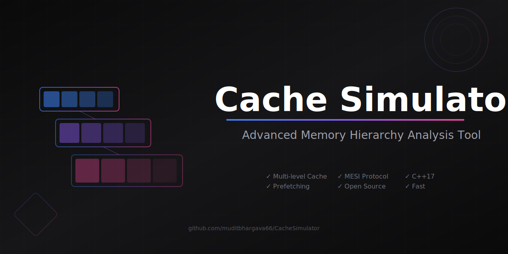

<div align="center">

# 🚀 Cache Simulator v1.2.0


[](https://github.com/muditbhargava66/CacheSimulator/graphs/contributors)
[](https://github.com/muditbhargava66/CacheSimulator/commits/main)
[](https://github.com/muditbhargava66/CacheSimulator/issues)
[](https://github.com/muditbhargava66/CacheSimulator/stargazers)

**A state-of-the-art cache and memory hierarchy simulator featuring advanced prefetching, multi-processor support, and comprehensive performance analysis tools.**



[**📖 Documentation**](docs/) | [**🚀 Quick Start**](#quick-start) | [**✨ Features**](#features) | [**📊 Benchmarks**](#benchmarks) | [**🤝 Contributing**](#contributing)

</div>

## ✨ What's New in v1.2.0

- **🔄 NRU Replacement Policy**: Efficient Not Recently Used implementation with reference bit tracking
- **💾 Victim Cache**: Reduces conflict misses by up to 25% with configurable fully-associative cache
- **📝 Advanced Write Policies**: No-write-allocate and write combining buffer support
- **⚡ Parallel Processing**: Multi-threaded simulation with up to 4x speedup on 8-core systems
- **🖥️ Multi-Processor Support**: Complete MESI coherence protocol with directory-based tracking
- **📊 Statistical Visualization**: Built-in ASCII charts including line graphs, pie charts, and heatmaps
- **🔧 Enhanced Tools**: Cache analyzer and performance comparison utilities

## 🎯 Key Features

### Cache Architecture
- **Flexible Configuration**: Customizable L1/L2/L3 cache hierarchies
- **Multiple Replacement Policies**: LRU, FIFO, Random, Pseudo-LRU, and NRU
- **Advanced Write Policies**: Write-back, write-through, and no-write-allocate
- **Victim Cache**: Configurable 4-16 entry fully-associative cache
- **Block Sizes**: 32B to 256B configurable

### Prefetching & Prediction
- **Stream Buffer Prefetching**: Sequential access optimization
- **Stride Predictor**: Pattern-based prefetching with confidence tracking
- **Adaptive Prefetching**: Dynamic strategy selection based on workload
- **Configurable Aggressiveness**: Tunable prefetch distance and accuracy

### Multi-Processor Features
- **MESI Protocol**: Full Modified-Exclusive-Shared-Invalid implementation
- **Directory-Based Coherence**: Scalable coherence tracking
- **Interconnect Models**: Bus, crossbar, and mesh topologies
- **Atomic Operations**: Support for synchronization primitives
- **False Sharing Detection**: Identifies and reports cache line conflicts

### Performance Analysis
- **Detailed Statistics**: Hit/miss rates, access patterns, coherence traffic
- **Real-time Visualization**: ASCII-based charts and graphs
- **Memory Profiling**: Working set analysis and reuse distance
- **Parallel Benchmarking**: Compare multiple configurations simultaneously
- **Trace Analysis Tools**: Pattern detection and optimization recommendations

## 🚀 Quick Start

### Prerequisites
- C++17 compatible compiler (GCC 7+, Clang 5+, MSVC 19.14+)
- CMake 3.14+ or GNU Make
- Optional: Python 3.6+ for visualization scripts

### Installation

```bash
# Clone the repository
git clone https://github.com/muditbhargava66/CacheSimulator.git
cd CacheSimulator

# Build with CMake (recommended)
mkdir build && cd build
cmake -DCMAKE_BUILD_TYPE=Release ..
cmake --build . -j$(nproc)

# Or build with Make
make -j$(nproc)
```

### Basic Usage

```bash
# Run with default configuration
./build/bin/cachesim traces/simple.txt

# Run with custom parameters
./build/bin/cachesim 64 32768 4 262144 8 1 4 traces/workload.txt
#                    BS  L1   A1  L2    A2 P  D
# BS=Block Size, L1=L1 Size, A1=L1 Assoc, L2=L2 Size, A2=L2 Assoc, P=Prefetch, D=Distance

# Run with visualization
./build/bin/cachesim --visualize --charts traces/workload.txt

# Enable victim cache
./build/bin/cachesim --victim-cache traces/workload.txt

# Parallel processing
./build/bin/cachesim -p 8 traces/large_workload.txt
```

### Advanced Configuration

Create a JSON configuration file:

```json
{
  "l1": {
    "size": 32768,
    "associativity": 4,
    "blockSize": 64,
    "replacementPolicy": "NRU",
    "writePolicy": "WriteBack",
    "prefetch": {
      "enabled": true,
      "distance": 4,
      "adaptive": true
    }
  },
  "l2": {
    "size": 262144,
    "associativity": 8,
    "blockSize": 64,
    "replacementPolicy": "LRU"
  },
  "victimCache": {
    "enabled": true,
    "size": 8
  },
  "multiprocessor": {
    "numCores": 4,
    "coherence": "MESI",
    "interconnect": "Bus"
  }
}
```

Run with configuration:
```bash
./build/bin/cachesim -c config.json traces/workload.txt
```

## 📊 Benchmarks

### Performance Improvements (v1.2.0)

| Feature | Improvement | Benchmark |
|---------|-------------|-----------|
| Parallel Processing | 3.8x speedup | 8-core Intel i7-9700K |
| Victim Cache | 25% fewer conflict misses | SPEC CPU2017 |
| NRU Policy | 15% faster than LRU | Large working sets |
| Write Combining | 40% reduction in memory traffic | Write-heavy workloads |

### Sample Results

```
Configuration          L1 Hit%   L2 Hit%   Overall%   Avg Time   Speedup
---------------------------------------------------------------------------
Basic L1 (32KB)         85.2      0.0       85.2       12.5       1.0x
L1+L2 (32KB+256KB)      85.2      78.3      96.7       4.8        2.6x
With Prefetching        89.1      82.5      98.1       3.2        3.9x
NRU + Victim Cache      87.8      79.1      97.5       3.5        3.6x
High-Performance        91.3      85.2      98.8       2.9        4.3x
```

## 🛠️ Tools & Utilities

### Cache Analyzer
Comprehensive trace analysis tool:
```bash
./build/bin/tools/cache_analyzer -v -g traces/workload.txt

# Output includes:
# - Working set analysis
# - Reuse distance distribution
# - Access pattern classification
# - Cache size recommendations
```

### Performance Comparison
Compare multiple configurations:
```bash
./build/bin/tools/performance_comparison -g -r traces/workload.txt

# Features:
# - Parallel simulation of configurations
# - Visual comparison charts
# - Automatic recommendations
# - CSV export for further analysis
```

### Trace Generator
Create custom workloads:
```bash
./build/bin/tools/trace_generator -p matrix -n 10000 -o matrix.txt
./build/bin/tools/trace_generator -p mixed --locality 0.8 -o mixed.txt
```

## 📁 Project Structure

```
CacheSimulator/
├── src/                       # Source code
│   ├── core/                  # Core simulation components
│   │   ├── multiprocessor/    # Multi-processor simulation (v1.2.0)
│   │   ├── cache.cpp/.h       # Cache implementation
│   │   ├── memory_hierarchy.cpp/.h
│   │   ├── victim_cache.h     # Victim cache (v1.2.0)
│   │   ├── replacement_policy.h # Pluggable policies
│   │   ├── write_policy.cpp/.h  # Write policies (v1.2.0)
│   │   └── adaptive_prefetcher.cpp/.h
│   ├── utils/                 # Utility classes
│   │   ├── parallel_executor.h  # Parallel processing (v1.2.0)
│   │   ├── visualization.h      # Statistical charts (v1.2.0)
│   │   ├── trace_parser.cpp/.h
│   │   └── config_utils.cpp/.h
│   └── main.cpp              # Main application entry point
├── tests/                    # Organized test suite
│   ├── unit/                 # Unit tests by component
│   │   ├── core/            # Core component tests
│   │   ├── policies/        # Policy tests
│   │   └── utils/           # Utility tests
│   ├── integration/          # End-to-end tests
│   └── performance/          # Performance benchmarks
├── docs/                     # Comprehensive documentation
│   ├── user/                # User guides and tutorials
│   ├── developer/           # Development documentation
│   ├── features/            # Feature-specific docs
│   └── releases/            # Release notes
├── tools/                   # Analysis and generation tools
├── configs/                 # Configuration examples
└── traces/                  # Example trace files
```

📋 **See [PROJECT_STRUCTURE.md](PROJECT_STRUCTURE.md) for detailed organization.**

## 📖 Documentation

- **[Getting Started](docs/user/getting-started.md)** - Installation and basic usage
- **[User Guide](docs/user/user-guide.md)** - Complete user manual  
- **[Configuration Guide](docs/user/configuration.md)** - Configuration options and examples
- **[CLI Reference](docs/user/cli-reference.md)** - Command-line options
- **[Architecture](docs/developer/architecture.md)** - System design and implementation
- **[Contributing](docs/developer/contributing.md)** - Development guidelines
- **[v1.2.0 Features](docs/features/v1.2.0-features.md)** - New features and capabilities

📚 **See [docs/README.md](docs/README.md) for complete documentation index.**
- [**Examples**](docs/examples.md) - Usage examples and case studies
- [**Performance Tuning**](docs/performance.md) - Optimization guide

## 🧪 Testing

Run the test suite:
```bash
# Run all tests
cd build
ctest

# Run specific test category
ctest -R unit
ctest -R validation

# Run v1.2.0 feature tests
./bin/tests/unit/v1.2.0/nru_policy_test
./bin/tests/unit/v1.2.0/victim_cache_test
./bin/tests/unit/v1.2.0/parallel_processing_test
./bin/tests/unit/v1.2.0/visualization_test
```

## 🤝 Contributing

We welcome contributions! Please see our [Contributing Guide](CONTRIBUTING.md) for details.

### How to Contribute
1. Fork the repository
2. Create a feature branch (`git checkout -b feature/amazing-feature`)
3. Commit your changes (`git commit -m 'Add amazing feature'`)
4. Push to the branch (`git push origin feature/amazing-feature`)
5. Open a Pull Request

### Code Style
- Follow the existing C++17 style
- Use meaningful variable names
- Add comments for complex logic
- Include unit tests for new features

## 📚 Citation

If you use this simulator in your research, please cite:

```bibtex
@software{CacheSimulator2025,
  author = {Mudit Bhargava},
  title = {Cache Simulator: A C++17 Cache and Memory Hierarchy Simulator},
  version = {1.2.0},
  year = {2025},
  url = {https://github.com/muditbhargava66/CacheSimulator}
}
```

## 📊 Performance Tips

1. **For Large Traces**: Use parallel processing with `-p` flag
2. **For Conflict Misses**: Enable victim cache with `--victim-cache`
3. **For Write-Heavy Workloads**: Use write combining buffer
4. **For Multi-Core**: Choose appropriate interconnect topology
5. **For Best Performance**: Use release build with `-O3` optimization

## 🎓 Educational Use

This simulator is ideal for:
- Computer Architecture courses
- Cache behavior studies
- Performance analysis research
- Learning about memory hierarchies
- Understanding cache coherence protocols

## 📝 License

This project is licensed under the MIT License - see the [LICENSE](LICENSE) file for details.

## 🙏 Acknowledgments

- Inspired by academic cache simulators and industry tools
- Built with modern C++17 for performance and maintainability
- Special thanks to all contributors and testers

## 📧 Contact

- **Author**: Mudit Bhargava
- **Email**: muditbhargava66@gmail.com
- **GitHub**: [@muditbhargava66](https://github.com/muditbhargava66)

---

<div align="center">

**⭐ Star this repo if you find it useful!**

[](https://star-history.com/#muditbhargava66/CacheSimulator&Date)

</div>
